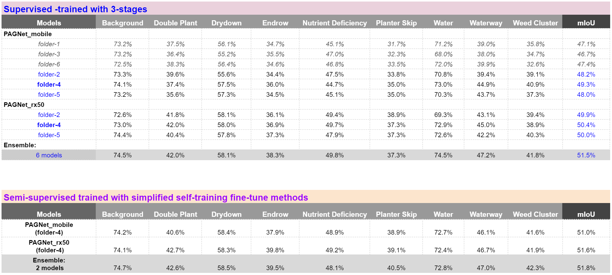

# MultiModNet

This repository contains the 3rd place solution (PAGNet models) for the 2nd Agriculture-Vision Prize Challenge (CVPR 2021), and a pytorch implementation of the MultiModNet framework as described in our paper: ["Multi-modal land cover mapping of remote sensing images using pyramid attention and gated fusion networks".](https://arxiv.org/abs/2111.03845) 

## Overview ##

We develop a novel multimodality semantic mapping framework for this challenge as shown in the Figure as below. The  proposed  framework  utilizes  a  novel  fusion  method,  namely  the  gated  fusion and late refinement mechanism, to effectively learn the optimal fused representation via  pyramid  attention  modules  (PAF)  from  multiple  modalities.  Specifically,  the PAF module is designed to efficiently obtain a rich contextual representation from each modality by a deeply fused cross-view and cross-level pyramid attention mechanism. The PAF fused features from the primary/predecessor modality (e.g, the RGB images) will be merged into the encoder of the supplementary/secondary modality (e.g, NIR/NDVI) via a gated fusion unit (GFU), which will automatically force the supplementary encoders to learn the most valuable information and weaken the influence of its redundancies or noises.  Our single PAGNet-mobile  (the parameter size is less than 7M)  can achieve 48.2% mIoU on  the AV challenge dataset.  With 6-model ensemble (total parameter size is less than 60M) achieves 51.5% mIoU for supervised track, while with 2-model ensemble, we can obtain 51.8% mIoU for semi-supervised track.  We used the same adaptive class weighting loss function from the paper : [Multi-view SelfConstructing Graph Convolutional Networks with Adaptive Class Weighting Loss for Semantic Segmentation](https://arxiv.org/pdf/2004.10327), to train all models. 


### Model Size for Agriculture-Vision challenge

| Models        | Backbones<br /> (Encoder-1 and 2) | Parameters | GFLOPs | Inference time <br />(CPU/GPU ) |
| ------------- | --------------------------------- | ---------- | ------ | ------------------------------- |
| PAGNet_mobile | MobileNetV3 / MobileNetV3         | 6.2        | 7.9    | 127/ 11 ms                      |
| PAGNet_rx50   | Se_ResNext50 / MobileNetV3        | 12.7       | 22.4   | 564/ 36 ms                      |

Please note that all backbones used pretrained weights on **ImageNet** that can be imported and downloaded from the [Se_ResNext50](https://github.com/Cadene/pretrained-models.pytorch#senet) and [MobileNetV3](https://github.com/d-li14/mobilenetv3.pytorch/blob/master/pretrained/mobilenetv3-large-1cd25616.pth). **PAGNet_mobile** used two same pre-trained MobileNetV3 as its two encoders and one PAG module with shared weights, while **PAGNet_rx50** has used Se_ResNext50 as the main encoder, and the other encoder is MobilenetV3 same as **PAGNet_mobile**, but two respective PAF module is used without share weights. Detailed descriptions about the proposed modules and network please see the appendix section. Please note the method details are from our un-released work that will be submitted to a Journal soon. 

**Note that: We use the same two networks for both supervised track and semi-supervised track.**

### Test scores on Agriculture-Vision 2021 test set


**In summary, what we do for supervised track are:**

- Using multimodal framework proposed to build two networks with different backbone encoders and PAF settings. and take NDVI instead of NIR as the input of secondary modality (NDVI = NIR-IR/ NIR+IR) during training and inference. 
- 6-fold cross-validation (randomly split, without pre-analysis) training with adaptive class weighting loss.  Base the first stage of training and test, we chose 3 best models of each network (so total 6 models), we fine-tune these 6 models with up to 2 more training stage. 
- Resized the input size 512 to 384 for training with bigger batch size and faster convergence with single GPU (NVIDIA 2080ti for PAGNet_mobile and NVIDIA 3090ti for PAGNet_rx50). Our code only support single GPU for train and test. 
- Model ensemble: since we trained 2 networks (PAGNet_mobile and PAGNet_rx50) separately in 6-fold CV. We select 3 models of each network  with best validation results. So total 6 models were ensembled for the final test. And also we used test time augmentation (TTA) for each model. 
- Max up to 3 stages for training each model. Each stage might using different optimizer (Adam to SGD) or different batch size (12, 16, 18, 24). 
- We use overfitting training method to fine-tune the trained model at earlier stage. Overfit train means that  we use all set (train/val) to fine-tune the model without keeping the validation set unseen. 

**In summary, what we do for semi-supervised track are:**

- Merge all test images into train set, validation set keep unchanged. 

- Use the best test results (51.5%mIoU) from supervised models as the pseudo/noise label for the test set.  

- Finetune one best PAGNet_rx50 model trained from supervised track with bigger batch size (24) and SCG optimizer with overfitting strategy. 

- Finetune one best PAGNet_mobile model trained from supervised track with raw input size (512x512) and bigger batch size (24) with overfitting strategy

- Ensemble the two models for final test with TTA and different input size (one is 384x384, another is 512x512).  We can obtain 51.8% mIoU for semi-supervised track.

  

## Code structure

```
├── config		 # config code
├── data		 # dataset loader and pre-processing code
├── tools		 # train and test code, ckpt and model_load
├── lib			 # model block, loss, utils code, etc
├── test_output	         # output test results
└── ckpt 		 # output check point, trained weights, log files, etc

```

**AND keep the dataset structure as the same with the official structure shown as below**
```
Agriculture-Vision-2021
|-- train
|   |-- masks
|   |-- labels
|   |-- boundaries
|   |-- images
|   |   |-- nir
|   |   |-- rgb
|-- val
|   |-- masks
|   |-- labels
|   |-- boundaries
|   |-- images
|   |   |-- nir
|   |   |-- rgb
|-- test
|   |-- boundaries
|   |-- images
|   |   |-- nir
|   |   |-- rgb
|   |-- masks
```
## Environments

- python 3.6+
- pytorch 1.7.1
- opencv 4.5+
- tensorboardx 2.1
- albumentations 0.5.2
- pretrainedmodels 0.7.4
- others (see requirements.txt)

## Dataset prepare

1. change DATASET_ROOT to your dataset path in ./code/data/agri_vision_2021/prepare_gt.py
```
# ----------- for supervised training ------------ #
# change DATASET ROOT to your supervised dataset path
DATASET_ROOT = '/your/path/to/supervised/Agriculture-Vision-2021/' # original 2021 dataset for supervised track


# ----------- for semi-supervised training --------#
# change DATASET ROOT to your semi-supervised dataset path 
# you need to manually merge the test images and pseudo labels to your training set
# DATASET_ROOT = '/your/path/to/semi-supervised/Agriculture-Vision-2021/' # self-training for semi-supervised track

```

## Reproducing the results  for supervised track (51.5%)

```
$ python ./code/tools/test_super.py
```

## Reproducing the results  for semi-supervised track (51.8%)

```
$ python ./code/tools/test_semi_super.py
```

## 6-folder CV  and 3-Stage Training process

1. Keep the dataset structure as the same with the official structure, and run the training scripts from stage1. e.g. run the script `./code/tools/ train_net1_s1.py` to train PAGNet_mobile of folder 4. To train other folders, you might need to manually change number of `kf` in the script as below:

    `train_args = agriculture2021_configs(
       net_name='PAGNet_mobile',
       data='Agriculture2021',
       bands_list=['RGB', 'NIR'],
       k_folder=6, # default 6 cv folders
       kf=4, # 0, 1, ..., 5 , the index of cv folder for val
       note='training'
   )`

2. For Stage 2 and Stage 3 trainings, run  `train_net1_s2.py` and `train_net1_s3.py`, but you need to manually set up the trained model from previous stage, i.e., `train_args.snapshot = 'xxx.pth' # copy the file name of the ckpt to resume the training with different hypeparameter..s`

3. Similarly, for training net2 (PAGNet_rx50), following above guild, to run  `train_net2_s1.py` ,`train_net2_s2.py` and `train_net2_s3.py` sequentially for each folder. 

4. For semi-supervised training, once your merged the pseudo labels predicted from your supervised trained models into the  `gt`, folder, then you can run the script  `train_net1_semi.py` and `train_net2_semi.py`. 

## Citation: 
Please consider citing our work if you find the code helps you

```
@article{Liu_2021_MultiModNet,
  title={Multi-modal land cover mapping of remote sensing images using pyramid attention and gated fusion networks},
  author={Liu, Qinghui and Kampffmeyer, Michael and Jenssen, Robert and Salberg, Arnt-B{\o}rre},
  journal={arXiv preprint arXiv:2111.03845},
  year={2021}
}
```

```
@InProceedings{Liu_2020_CVPR_Workshops,
author = {Liu, Qinghui and Kampffmeyer, Michael C. and Jenssen, Robert and Salberg, Arnt-Borre},
title = {Multi-View Self-Constructing Graph Convolutional Networks With Adaptive Class Weighting Loss for Semantic Segmentation},
booktitle = {The IEEE/CVF Conference on Computer Vision and Pattern Recognition (CVPR) Workshops},
month = {June},
year = {2020}
}
```


